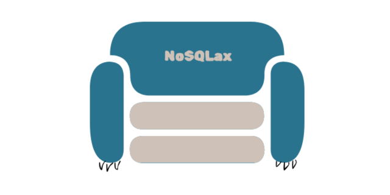

# NoSQLax 💤 - A Relaxed Repository for CouchDB
NoSQLax is a lightweight JavaScript library designed to simplify and streamline CRUD operations with CouchDB. Inspired by the laid-back Snorlax and CouchDB's "Relax" philosophy, NoSQLax provides a unified and intuitive repository pattern to handle your data effortlessly.

## Key Features
- Seamless CRUD Operations: Easily manage documents in CouchDB with consistent and easy-to-use methods.
- Built-In JSON Schema Validation: Ensure data integrity with schema validation powered by AJV.
- Extensible Architecture: Extend and customize repositories for more complex use cases.
- Developer-Friendly: Focus on building your application with minimal boilerplate and maximum clarity.
- Simplifies CouchDB Interactions: A clean and consistent API makes working with CouchDB as relaxed as its motto.

## Installation

## Getting started
Example:
```
// example.js
const { CouchRepository, BaseEntity } = require('nosqlax');

// Define a validation schema for your User documents using JSON Schema syntax
const validationSchema = {
  type: "object",
  properties: {
    name: { type: "string" },
    email: { type: "string", format: "email" },
  },
  required: ["name", "email"], // Define required fields
  additionalProperties: false // Do not allow additional properties
};

// Define your entities by extanding the BaseEntity class
class UserEntity extends BaseEntity {
  constructor(data = {}) {
    super(data); // Call the BaseEntity constructor
    this.name = data.name || '';
    this.email = data.email || '';
  }

  // Static validation schema for UserEntity
  static get validationSchema() {
    return {
      type: 'object',
      properties: {
        name: { type: 'string' },
        email: { type: 'string' },
        docType: { type: 'string', const: 'user' },
        _id: { type : 'string'},
        _rev: { type : 'string'}
      },
      required: ['name', 'email', 'docType'],
      additionalProperties: false,
    };
  }

  // Static docType for UserEntity
  static docType = 'user'
}

// Define the user repository that will interact with the database by extending the CouchRepository class
class UserRepository extends CouchRepository {
  constructor(nanoConnection) {
    super(nanoConnection, UserEntity); // Pass the connection and UserEntity to the base class
  }
}

// Define your user service
class UserService {
  constructor(userRepository) {
    this.userRepository = userRepository;
  }

  async createUser(userData) {
    // Create a new user using the UserRepository
    return await this.userRepository.create(userData);
  }

  async getUserById(id) {
    // Fetch a user by ID
    return await this.userRepository.read(id);
  }

  async updateUser(id, userData) {
    // Update user information
    return await this.userRepository.update(id, userData);
  }

  async deleteUser(id) {
    // Delete a user by ID
    return await this.userRepository.delete(id);
  }
}

// example.js
const Nano = require('nano');

// Example: Create a CouchDB connection using Nano (or your custom connection)
const nano = Nano('http://localhost:5984');
const usersDb = nano.db.use('users'); // Use the 'users' database

const userRepository = new UserRepository(usersDb);
const userService = new UserService(userRepository); // Create an instance of UserService

(async () => {
  try {
    // 1. Create a new user
    const newUser = new UserEntity({
      name: 'Jane Doe',
      email: 'jane.doe@example.com'
    });
    
    const createdUser = await userService.createUser(newUser);
    console.log('User created:', createdUser);

    // 2. Get the user by ID
    const fetchedUser = await userService.getUserById(createdUser.uuid);
    console.log('Fetched User:', fetchedUser);

    // 3. Update the user
    const updatedUser = await userService.updateUser(createdUser.uuid, {
      name: 'Jane Smith',
      email: 'jane.smith@example.com',
    });
    console.log('Updated User:', updatedUser);

    // 4. Delete the user
    const deleteResponse = await userService.deleteUser(createdUser.uuid);
    console.log(deleteResponse);
  } catch (error) {
    console.error('Error:', error.message);
  }
})();

```
